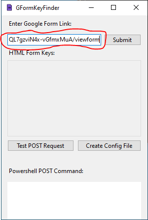
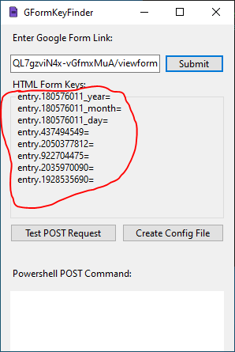
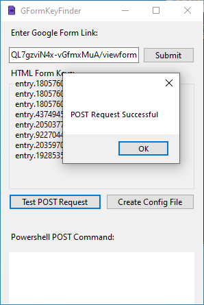
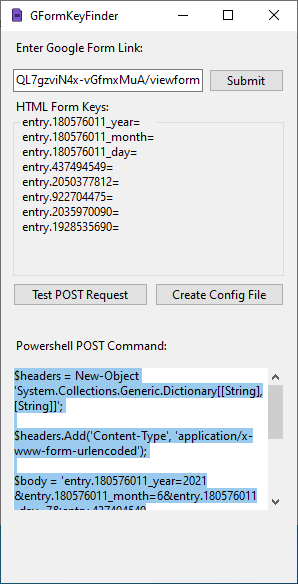

# GFormKeyFinder
Windows Forms Application that scrapes HTML of a Google Form, and returns the key values needed to fill out a POST request.

# Installation 

Inside of the Project Directory, navigate to the public folder. Then, inside the folder, double click setup.exe, and the program will download.

NOTE: The Google Form must be set to public in order for POST requests to return entry keys

# Usage

Locate the link for your google form, and paste it into the textbox, and click the Submit button

Afterwards, there should be a list of entry keys taken from the Google Form as seen below: 
NOTE: The entry keys are appended with a '=' symbol to accomodate for config file format for a separate application. For the actual entry key, remove the '=' symbols at the end of the string.

If you want to test if a POST request is successful whilst using these entry keys, click the "Test POST Request" button. Doing this will also provide the code in PowerShell that enables one to send a POST request to the Google Form.

Copy the PowerShell Code as needed. Furthermore, if you wish to save the keys to a Config file or want to append the keys to an existing file, click the "Create Config File" button.

# Known Issues
When Opening the project in C#, the GUI builder may not display. To resolve this, find Form1.resx > Right Click > View Designer. The GUI Builder should now show without any issues. 

